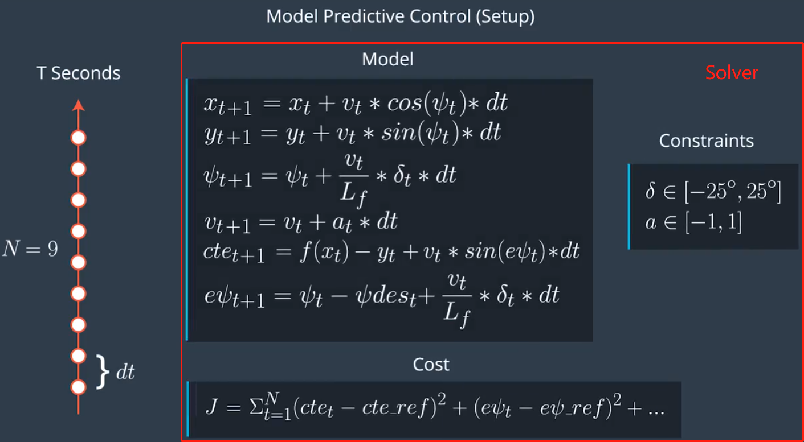

# CarND-Controls-MPC
Self-Driving Car Engineer Nanodegree Program


* Yellow Line : The waypoints/reference line
* Green Line : The MPC predict trajectory

## Write Up

---

## Vehicle Model

### Bicycle model


* **X**,**Y** : global axes
* **x**,**y** : vehicle coordinate axes
* psi : yaw angle of vehicle in global axes
* psi_des : desired yaw rate from road
* delta : streeing wheel angle

### State

  state = [x,y,psi,v,cte,epsi]

* x,y : global (x,y) position of the vehicle
* psi : the orientation of the vehicle
* v : the velocity of the vehicle
* cte : cross track error
* epsi : orientation error


**Cross Track Error**

At the current state, the cte is defined as :

cte = y - f(x)

where , 

* y : is current vehicle position 
* f(x) :  is the reference line


**Orientation Error**

At the current state, the epsi is defined as :

epsi = psi - psi_des

where ,

* psi : is the part of state
* psi_des : can be calculate as the [tangential angle](https://en.wikipedia.org/wiki/Tangential_angle) of the polynomial *f* evaluated at *x*,*arctan(f'(x))*.*f'* is the derivative of the polynomial.


## Predict Next State

We can predict the next state(state at time t+1) by using the current state(state at time t) and the kinematic equations,which are defined as :

x1 = x0 + v0 * cos(psi) * dt

y1 = y0 + y0 * sin(psi) * dt

psi1 = psi0 + (v0 / Lf) * delta0 * dt

v1 = v0 + a0 * dt

cte1 = cte0 + v0 * sin(epsi0) * dt 

epsi1 = epsi0 + (v0 / Lf) * delta0 * dt


* x0,y0,psi0,v0,cte0,epsi0 : the values of the state(x,y,psi,v,cte,epsi) at time t
* x1,y1,psi1,v1,cte1,epsi1 : the values of the state(x,y,psi,v,cte,epsi) at time t+1
* dt : timestep duration
* Lf : measures the distance between the center of mass of the vehicle and it's front axle


## Model Predictive Control

### Converting to vehicle's coordinate

* Resetting Origin : Setting the current position (px,py) as the origin of the global coordinate

* [Coordinate Transformations](http://farside.ph.utexas.edu/teaching/336k/Newtonhtml/node153.html) :
Convertting the waypoints from global coordinate to vehicle's coordinate

  x' = (x - px) * cos(psi) + (y - py) * sin(psi)

  y' = - (x - px) * sin(psi) + (y - py) * cos(psi)

  where , 

  (x,y) : are the global positions of the waypoints

  (px,py) : is the global position of the vehicle

  psi : is the orientation of the vehicle

  (x',y') : are the positions of the waypoints in the vehicle's coordinate,whose origin is the current position of the vehicle


* [Fitting Polynomial](https://github.com/JuliaMath/Polynomials.jl/blob/master/src/Polynomials.jl#L676-L716) : Use *polyfit()* to fit a 3rd order polynomial to the given x' and y' coordinates representing waypoints 

### MPC Solve



Steps:

* Set N and dt
* Fit the polynomial to the waypoints
* Calculate initial cross track error and orientation error values
* Define the components of the cost function
* Define the model constraints


### Tuning MPC

* **T** : the prediction horizon , T = N * dt

  In the case of driving car ,T should be a few seconds,at most. T should be as large as possible,while dt should be as small as possible.

* **N** : is the number of timesteps in the horizon

  N determines the number of variables optimized by the MPC.So,the larger the N ,the larger the computation.

* **dt** : is how much time elapses between actuations

  Larger values of dt result in less frequent actuations,which makes it harder to accurately approximate a continuous reference trajectory.

* [**Tuning Cost Function Weights**](https://www.mathworks.com/help/mpc/ug/tuning-weights.html?s_eid=PSM_15028) : Multiplying each part of the cost by a factor,will help to  balance competing objectives

  If all factors are one ,then each part of the cost has the average priority.The larger the factor ,the higher the priority of this part ,which means the tracking error desired is smaller.The smaller the factor ,the lower the priority of this part ,which means the tracking error acceptable is larger.

  **cte_factor and epsi_factor** : These two factors affect the two main objectives: cte error and epsi error.The larger these factors are,the better the vehicle can track the trajectory.

  **delta_factor** : This factor affect the change rate of delta.By tuning this factor,we can make the vehicle turn smoothly,not sharply.
  
  **a_factor** : This factor influence the change rate of velocity.By tuning this factor,we can avoid the vehicle velocity change too radically.

  **diff_delta_factor** : Adjust this factor to make the vehcile turn smoother.

  **diff_a_factor** : Adjusting this factor can make the velocity change smoother.


Cost Function Code:
```
fg[0] = 0;
    for (int i = 0;i < N ;i++){

      fg[0] += cte_factor * CppAD::pow(vars[cte_start + i] - ref_cte,2);
      fg[0] += epsi_factor * CppAD::pow(vars[epsi_start + i] - ref_epsi,2);
      fg[0] += CppAD::pow(vars[v_start + i] - ref_v,2);

    }

    // Minimize the change rate
    for (int i =0;i < N -1 ;i++){

      fg[0] += delta_factor * CppAD::pow(vars[delta_start + i],2);
      fg[0] += a_factor * CppAD::pow(vars[a_start + i],2);
    }

    // Minimize the value gap between sequential actuations
    for (int i= 0;i < N -2 ;i++){
      fg[0] += diff_delta_factor * CppAD::pow(vars[delta_start + i + 1] - vars[delta_start + i],2);
      fg[0] += diff_a_factor * CppAD::pow(vars[a_start + i + 1] - vars[a_start + i],2);

    }

```


### Dependencies

* cmake >= 3.5
 * All OSes: [click here for installation instructions](https://cmake.org/install/)
* make >= 4.1(mac, linux), 3.81(Windows)
  * Linux: make is installed by default on most Linux distros
  * Mac: [install Xcode command line tools to get make](https://developer.apple.com/xcode/features/)
  * Windows: [Click here for installation instructions](http://gnuwin32.sourceforge.net/packages/make.htm)
* gcc/g++ >= 5.4
  * Linux: gcc / g++ is installed by default on most Linux distros
  * Mac: same deal as make - [install Xcode command line tools]((https://developer.apple.com/xcode/features/)
  * Windows: recommend using [MinGW](http://www.mingw.org/)
* [uWebSockets](https://github.com/uWebSockets/uWebSockets)
  * Run either `install-mac.sh` or `install-ubuntu.sh`.
  * If you install from source, checkout to commit `e94b6e1`, i.e.
    ```
    git clone https://github.com/uWebSockets/uWebSockets
    cd uWebSockets
    git checkout e94b6e1
    ```
    Some function signatures have changed in v0.14.x. See [this PR](https://github.com/udacity/CarND-MPC-Project/pull/3) for more details.

* **Ipopt and CppAD:** Please refer to [this document](https://github.com/udacity/CarND-MPC-Project/blob/master/install_Ipopt_CppAD.md) for installation instructions.
* [Eigen](http://eigen.tuxfamily.org/index.php?title=Main_Page). This is already part of the repo so you shouldn't have to worry about it.
* Simulator. You can download these from the [releases tab](https://github.com/udacity/self-driving-car-sim/releases).
* Not a dependency but read the [DATA.md](./DATA.md) for a description of the data sent back from the simulator.


### Basic Build Instructions

1. Clone this repo.
2. Make a build directory: `mkdir build && cd build`
3. Compile: `cmake .. && make`
4. Run it: `./mpc`.

